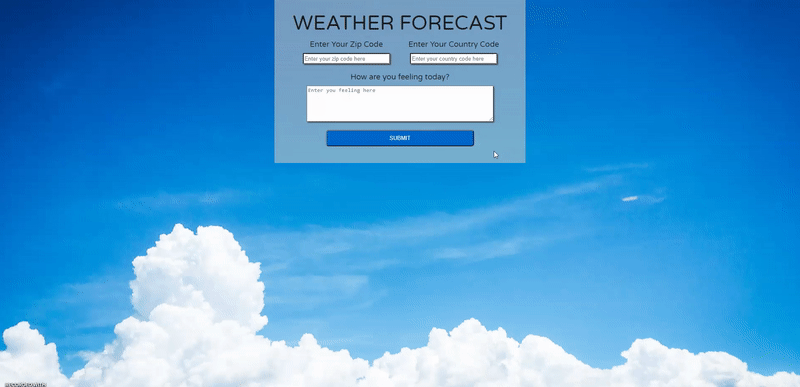

<!-- Add banner here -->

# My-Weather-Journal-App

<!-- Describe your project in brief -->
This project is to create an asynchronous web app that uses **Web API** and user data to dynamically update the UI in a Weather Journal application by using **Express** as a server framework on **Node.js**. 

*this project is part of Udacity front end web developer nanodegree program.*

# Demo-Preview

<!-- Add a demo for your project -->
[Project Demo Link](https://thasup-weather-journal.onrender.com/)

# Table of contents

- [My-Weather-Journal-App](#my-weather-journal-app)
- [Demo-Preview](#demo-preview)
- [Table of contents](#table-of-contents)
- [Install](#install)
- [Languages](#languages)
- [Features](#features)
- [Technology](#technology)

# Install
[(Back to top)](#table-of-contents)

1. clone this git on computer
2. install node.js, nodemon
3. run command `npm install` on terminal
4. run command `nodemon server` on terminal
5. go to `http://localhost:8000/`
6. happy!

# Languages
[(Back to top)](#table-of-contents)

- HTML
- CSS
- JavaScript

# Features
[(Back to top)](#table-of-contents)

- Integrating OpenWeatherMap API
- Dynamically Update UI

# Technology
[(Back to top)](#table-of-contents)

- html
- css/scss
- javascript
- DOM
- node.js
- express.js
- API
- render
